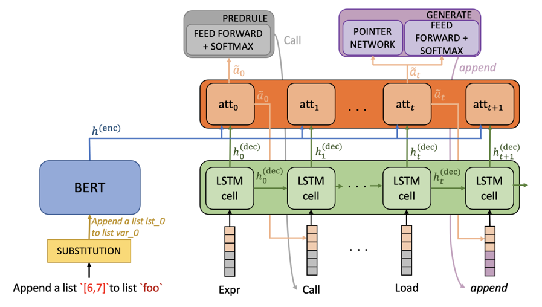

# BERTranX

We present an architecture based on **BERT** encoder and a general-purpose **Tran**sition-based abstract synta**X** parser
that maps natural language queries into Python code.

## System Architecture

For technical details please refer to our [Findings of ACL '22 paper](https://arxiv.org/pdf/2202.13972). 
As in [TranX architecture](https://arxiv.org/abs/1806.07832), we use abstract syntax trees (ASTs) defined in the 
Abstract Syntax Description Language (ASDL) as intermediate meaning
representation to generate code.



Figure 1 gives a brief overview of the system.


**File Structure**: 

```bash
├── asdl (contains grammar informations, AST operations and transition system)
├── components (vocabulary creation and class)
├── config (config files to change hyperparameters)
├── dataset (data sets and preprocessing)
├── model (PyTorch implementation of neural nets)
├── outputs (models parameters saved and results)
```

### Evaluation Results

Here is a list of performance results on six datasets using pretrained models in `data/pretrained_models`

| Dataset | BLEU results | Accuracy results |
| ------- |--------------|------------------|
| Django  | 79.86        | 79.77            |
| CoNaLa  | 34.20        | 5.8              |


## Usage


### TL;DR

```bash
git clone https://github.com/pcyin/tranX
cd tranX

bash ./getdata.sh  # get datasets and pre-trained models

conda env create -f config/env/tranx.yml  # create conda Python environment.

./scripts/atis/train.sh 0  # train on ATIS semantic parsing dataset with random seed 0
./scripts/geo/train.sh 0  # train on GEO dataset
./scripts/django/train.sh 0  # train on django code generation dataset
./scripts/conala/train.sh 0  # train on CoNaLa code generation dataset
./scripts/wikisql/train.sh 0  # train on WikiSQL SQL code generation dataset
```

## Reference

BertranX is described in the following paper:

```
... waiting for publication ...
```

## Thanks

We are also grateful to the following papers that inspire this work :P
```
TRANX: A Transition-based Neural Abstract Syntax Parser for Semantic Parsing and Code Generation.
Pengcheng Yin and Graham Neubig.
In Conference on Empirical Methods in Natural Language Processing (EMNLP), 2018.
```

### Installation

```bash
git clone https://github.com/BertranX.git
cd BertranX
bash ./getdata.sh  # get datasets and preprocess
```